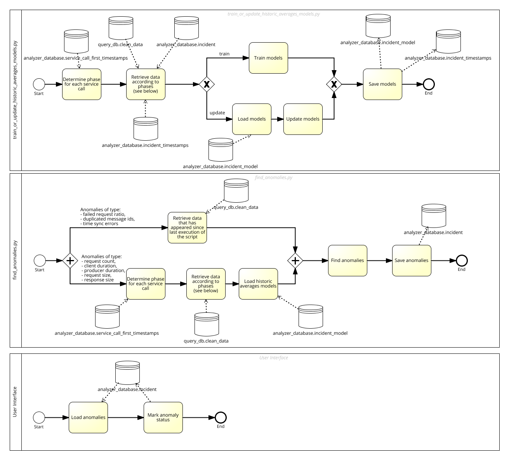

# X-Road v6 monitor project - Analysis Module

## About

**Analysis module** is part of [X-Road v6 monitor project](../readme.md), which includes modules of [Database module](database_module.md), [Collector module](collector_module.md), [Corrector module](corrector_module.md), Analysis module (this document), [Reports module](reports_module.md) and [Opendata module](opendata_module.md).

Overall system, its users and rights, processes and directories are designed in a way, that all modules can reside in one server (different users but in same group) and also in separate servers. 

Overall system is also designed in a way, that allows to monitor data from different X-Road v6 instances (`ee-dev`, `ee-test`, `EE`), see also [X-Road v6 environments](https://www.ria.ee/en/x-road-environments.html#v6).

Overall system is also designed in a way, that can be used by X-Road Centre for all X-Road members as well as for Member own monitoring (includes possibilities to monitor also members data exchange partners).

## Architecture

Analysis module is responsible for detecting and presenting anomalies in the usage of different X-road components. 
The Analysis module consists of two parts:

- **Analyzer:** the back-end of the analysis module, responsible for detecting anomalies based on requests made via the X-road platform.
- **Interface:** the front-end of the analysis module, responsible for presenting the found anomalies to the user and recording user feedback.

## Process

As mentioned on the diagram, service calls can be in different phases which determines how the data for a given service call is retrieved

1. In script ``train_or_update_historic_averages_models.py``, a service call can be in one of the following phases:

1) pre-training: less than 3 months have passed since the first request was made by that service call. No data are retrieved.
2) first-time training: 3 months have just passed since the first request. All the data will be retrieved for training.
3) second-time training: the first model was trained at least 10 days ago and the first incidents have just expired. Data are retrieved since the beginning until the time of the expired incidents (excluding requests that are part of a "true" incident). The model is retrained.
4) regular: data are retrieved since the last update to the model until the time of the expired incidents (excluding requests that are part of a "true" incident). The model is updated based on these data.

2. In script ``find_anomalies.py``, a service call can be in one of the following phases:

1) pre-training: less than 3 months have passed since the first request was made by that service call. No data are retrieved.
2) first-time anomaly finding: 3 months have passed since the first request and the first version of the model has just been trained. All the data will be retrieved for anomaly finding.
3) regular: data are retrieved since the last anomaly finding time until the "present" moment ("present" means the last valid date considering the corrector buffer, i.e. 10 days ago). Anomalies are found based on these data.

## Installation

Before the module can be used, the following components must be set up and actions performed:

1. Apache must be set up to serve Interface;
2. Python codebase must be installed and configured;
3. Initial anomaly models must be calculated.

The detailed instructions can be found ==> [here](analysis_module/installation.md) <==

## Configuration

Descriptions of different secondary configuration/customization files and parameters can be found ==>  [here](analysis_module/customization.md) <==

## Usage

Use Case-based functionality descriptions with illustrative screenshots can be found ==> [here](analysis_module/usage.md) <==
