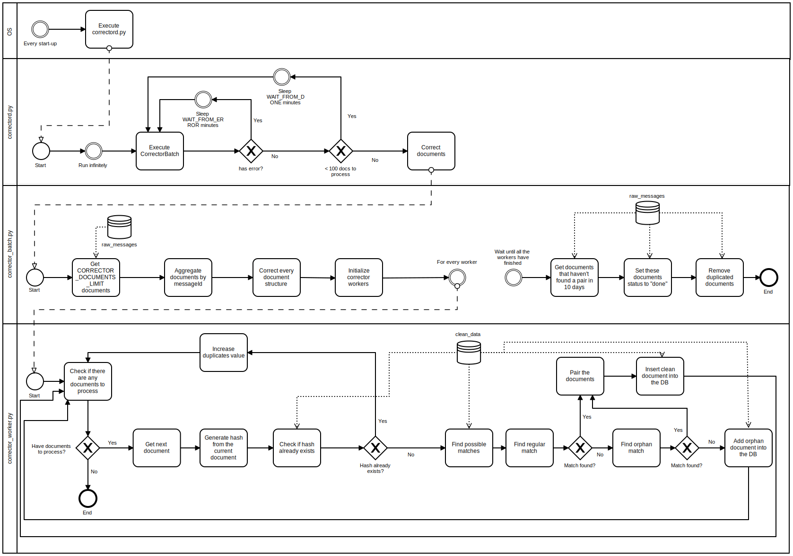

# X-Road v6 monitor project - Corrector Module

## About

The corrector module is part of [X-Road v6 monitor project](../readme.md), which includes modules of [Database module](database_module.md), [Collector module](collector_module.md), [Corrector module (this document)](corrector_module.md), [Analysis module](analysis_module.md), [Reports module](reports_module.md) and [Opendata module](opendata_module.md).

Overall system, its users and rights, processes and directories are designed in a way, that all modules can reside in one server (different users but in same group) and also in separate servers. 

Overall system is also designed in a way, that allows to monitor data from different X-Road v6 instances (`ee-dev`, `ee-test`, `EE`), see also [X-Road v6 environments](https://www.ria.ee/en/x-road-environments.html#v6).

Overall system is also designed in a way, that can be used by X-Road Centre for all X-Road members as well as for Member own monitoring (includes possibilities to monitor also members data exchange partners).

The **corrector module** is responsible to clean the raw data from corrector and derive monitoring metrics in a clean database collection. The execution of the corrector module is performed automatically via a **service** task.

The module source code can be found at (ACL-protected):

```
https://stash.ria.ee/projects/XTEE6/repos/monitor/browse
```

and can be downloaded into server (ACL-protected):

```bash
export TMPDIR="/tmp" ; mkdir --parents ${TMPDIR}; cd ${TMPDIR}
# NB! git clone required only once
git clone https://stash.ria.ee/scm/xtee6/monitor.git
# when want just to refresh existing repository, use pull
cd ${TMPDIR}/monitor; git pull https://stash.ria.ee/scm/xtee6/monitor.git
```

## Diagram



## Pair matching logic
The first step is to add the missing fields into the document (in case it is missing some). 
The value will be "None" for the missing fields. 
The fields that MUST be there for each document are the following:
```
'monitoringDataTs', 'securityServerInternalIp', 'securityServerType', 'requestInTs', 'requestOutTs',
'responseInTs', 'responseOutTs', 'clientXRoadInstance', 'clientMemberClass', 'clientMemberCode',
'clientSubsystemCode', 'serviceXRoadInstance', 'serviceMemberClass', 'serviceMemberCode',
'serviceSubsystemCode', 'serviceCode', 'serviceVersion', 'representedPartyClass', 'representedPartyCode',
'messageId', 'messageUserId', 'messageIssue', 'messageProtocolVersion', 'clientSecurityServerAddress',
'serviceSecurityServerAddress', 'requestSoapSize', 'requestMimeSize', 'requestAttachmentCount',
'responseSoapSize', 'responseMimeSize', 'responseAttachmentCount', 'succeeded', 'soapFaultCode',
'soapFaultString'
```
Before finding a match, a hash is calculated for the current document. The following fields are included:
```
'monitoringDataTs', 'securityServerInternalIp', 'securityServerType', 'requestInTs', 
‘requestOutTs', 'responseInTs', 'responseOutTs', 'clientXRoadInstance', 'clientMemberClass', 
'clientMemberCode', 'clientSubsystemCode', 'serviceXRoadInstance', 'serviceMemberClass', 
'serviceMemberCode', 'serviceSubsystemCode', 'serviceCode', 'serviceVersion', 
'representedPartyClass', 'representedPartyCode', 'messageId', 'messageUserId', 
'messageIssue', 'messageProtocolVersion', 'clientSecurityServerAddress', 
'serviceSecurityServerAddress', 'requestSoapSize', 'requestMimeSize', 
‘requestAttachmentCount', 'responseSoapSize', 'responseMimeSize', ‘responseAttachmentCount', 
'succeeded', 'soapFaultCode', 'soapFaultString'
```
The fields excluded from the hash are the following:
```
'_id', 'insertTime' 'corrected'
```
After calculating the hash it is checked that the hash doesn't already exist in the DB (clean_data). 
If it does exist, the document is skipped.

If the hash doesn't exist, then possible matches are queried for the document.
The possible matches are queried using the following rules:
* 'messageId' == currentDocument's messageId'
* 'correctorStatus' == 'processing'
* (currentDoc's 'requestInTs' - 60s) <= 'requestInTs' <= (currentDoc's 'requestInTs' + 60s)
* If the current document's 'securityServerType' == 'Client' then we query only the documents that have 'clientHash' == None
* If the current document's 'securityServerType' == 'Producer' then we query only the documents that have 'producerHash' == None

Then all the possible candidates will be first matched using regular match to make up the pair.
The 'requestInTs' time difference must be <= 60 seconds for BOTH the regular and orphan match.
The fields that must be equal for regular match are the following:
```
'clientMemberClass', 'requestMimeSize', 'serviceSubsystemCode', 'requestAttachmentCount',
'serviceSecurityServerAddress', 'messageProtocolVersion', 'responseSoapSize', 'succeeded',
'clientSubsystemCode', 'responseAttachmentCount', 'serviceMemberClass', 'messageUserId',
'serviceMemberCode', 'serviceXRoadInstance', 'clientSecurityServerAddress', 'clientMemberCode',
'clientXRoadInstance', 'messageIssue', 'serviceVersion', 'requestSoapSize', 'serviceCode',
'representedPartyClass', 'representedPartyCode', 'soapFaultCode', 'soapFaultString',
'responseMimeSize', 'messageId'
```
If no match is found, then the orphan match will be used.
The fields that must be equal for orphan match are the following:
```
'clientMemberClass', 'serviceSubsystemCode', 'serviceSecurityServerAddress', 'messageProtocolVersion', 'succeeded',
'clientSubsystemCode', 'serviceMemberClass', 'messageUserId', 'serviceMemberCode', 'serviceXRoadInstance',
'clientSecurityServerAddress', 'clientMemberCode', 'clientXRoadInstance', 'messageIssue', 'serviceVersion',
'serviceCode', 'representedPartyClass', 'representedPartyCode', 'soapFaultCode', 'soapFaultString', 'messageId'
```
If still no match found then the document will be added into the clean_data as "orphan".
If the match was found then the documents will be paired and added into the clean_data as either "regular_pair" or "orphan_pair".

## Networking

### Outgoing

The corrector module needs access to the Database Module (see [Database_Module](database_module.md)).

### Incoming

No **incoming** connection is needed in the corrector module.

## Installation

This sections describes the necessary steps to install the **corrector module** in a Linux Ubuntu 16.04. To a complete overview of different modules and machines, please refer to the [System Architecture](system_architecture.md) documentation.

### Install required packages

To install the necessary packages, execute the following commands:

```bash
sudo apt-get install python3-pip
sudo pip3 install pymongo==3.4.0
```

### Install corrector module

The corrector module uses the system user **corrector** and group **opmon**. To create them, execute:

```bash
sudo groupadd --force opmon
sudo useradd --base-dir /opt -M --system --shell /bin/false --gid opmon corrector
```

The module files should be installed in the APPDIR directory, within a sub-folder named after the desired X-Road instance. 
In this manual, `/srv/app` is used as APPDIR and the `ee-dev` is used as INSTANCE (please change `ee-dev` to map your desired instance, example: `ee-test`, `EE`).

```bash
export APPDIR="/srv/app"
export INSTANCE="ee-dev"
# make necessary directories
sudo mkdir --parents ${APPDIR}/${INSTANCE}
sudo mkdir --parents ${APPDIR}/${INSTANCE}/logs
sudo mkdir --parents ${APPDIR}/${INSTANCE}/heartbeat
# correct necessary permissions
sudo chown root:opmon ${APPDIR}/${INSTANCE}/logs
sudo chmod g+w ${APPDIR}/${INSTANCE}/logs
sudo chown root:opmon ${APPDIR}/${INSTANCE}/heartbeat
sudo chmod g+w ${APPDIR}/${INSTANCE}/heartbeat
```

Copy the **corrector** code to the install folder and fix the file permissions:

```bash
# export TMPDIR="/tmp"; export APPDIR="/srv/app"; export INSTANCE="ee-dev"
sudo rsync --recursive --update --times ${TMPDIR}/monitor/corrector_module ${APPDIR}/${INSTANCE}
# or 
# sudo cp --recursive --update ${TMPDIR}/monitor/corrector_module ${APPDIR}/${INSTANCE}
```

Settings for different X-Road instances have been prepared and can be used:

```bash
# export APPDIR="/srv/app"; export INSTANCE="ee-dev"
sudo rm ${APPDIR}/${INSTANCE}/corrector_module/settings.py
sudo ln --symbolic ${APPDIR}/${INSTANCE}/corrector_module/settings_${INSTANCE}.py ${APPDIR}/${INSTANCE}/corrector_module/settings.py
```

If needed, edit necessary modifications to the settings file using your favorite text editor (here, **vi** is used):

```bash
# export APPDIR="/srv/app"; export INSTANCE="ee-dev"
sudo vi ${APPDIR}/${INSTANCE}/corrector_module/settings.py
```

Correct necessary permissions

```bash
# export APPDIR="/srv/app"; export INSTANCE="ee-dev"
sudo chown --recursive corrector:opmon ${APPDIR}/${INSTANCE}/corrector_module
sudo chmod --recursive -x+X ${APPDIR}/${INSTANCE}/corrector_module
sudo chmod +x ${APPDIR}/${INSTANCE}/corrector_module/*.sh
```

Prepare system service to run corrector module with:

```bash
# export INSTANCE="ee-dev"
sudo vi /lib/systemd/system/corrector_${INSTANCE}.service
```

Add the following content (replace INSTANCE `èe-dev` to map your desired instance, example: `ee-test`, `EE`):

```
[Unit]
Description=Corrector Service ee-dev
After=multi-user.target

[Service]
User=corrector
Group=opmon
WorkingDirectory=/srv/app/ee-dev/
ExecStart=/usr/bin/python3 /srv/app/ee-dev/corrector_module/correctord.py

[Install]
WantedBy=multi-user.target
```

Change the permission of the service file with:

```bash
# export INSTANCE="ee-dev"
sudo chmod 644 /lib/systemd/system/corrector_${INSTANCE}.service
```

And execute the following commands to have the service enabled:

```bash
# export INSTANCE="ee-dev"
sudo systemctl daemon-reload
sudo systemctl enable corrector_${INSTANCE}.service
sudo service corrector_${INSTANCE} start
```

If necessary, the service can be stopped with:

```bash
# export INSTANCE="ee-dev"
sudo service corrector_${INSTANCE} stop
```

The status of the service can be monitored via:

```bash
# export INSTANCE="ee-dev"
sudo service corrector_${INSTANCE} status
```


Note: If the corrector code is updated, the service needs to be restarted with:

```
sudo service corrector_${INSTANCE} stop
sudo service corrector_${INSTANCE} start
```

or with:

```
sudo service corrector_${INSTANCE} restart
```


## Manual usage

Make sure the corrector is not running as a service with:

```bash
# export INSTANCE="ee-dev"
sudo service corrector_${INSTANCE} stop
sudo service corrector_${INSTANCE} status
```

To check commands manually as corrector user, execute:

```bash
# export APPDIR="/srv/app"; export INSTANCE="ee-dev"
cd ${APPDIR}/${INSTANCE}/corrector_module; sudo --user corrector ./service_corrector.sh
```

## TODO

Corrector has current limit in settings `CORRECTOR_DOCUMENTS_LIMIT = 20000` within one run to ensure RAM and CPU is not overloaded during calculations.
At same time, we have to ensure, that all collected documents are processed within given timeframe (please refer to the [System Architecture](system_architecture.md) and [Collector](collector_module.md) documentation for more background). 
To prevent many parallel processes and avoid system locking, it is suggested to implement some locking mechanism or configure corrector as a service.

## Monitoring and Status

### Logging 

The **corrector module** produces log files that, by default, is stored at `${APPDIR}/${INSTANCE}/logs`:

To change the logging level, it is necessary to change the logger.setLevel parameter in the settings file:

```python
# INFO - logs INFO & WARNING & ERROR
# WARNING - logs WARNING & ERROR
# ERROR - logs ERROR
logger.setLevel(logging.INFO)
```

The time format for durations in the log files is the following: "HH:MM:SS".
For example:

```
"Finished process. Processing time: 00:02:56"
```

### Heartbeat

The Corrector module has a heartbeat.json file, by default, is stored at `${APPDIR}/${INSTANCE}/heartbeat`.

The heartbeat file consist of the following fields:

```
timestamp - the timestamp when the heartbeat was updated
module - module name
msg - message
version - version
```

The settings (in the settings file) for the heartbeat file are the following:

```python
# --------------------------------------------------------
# Configure heartbeat
# --------------------------------------------------------
HEARTBEAT_NAME = 'heartbeat_corrector_{0}'.format(MONGODB_SUFFIX)
HEARTBEAT_LOGGER_PATH = '/srv/app/ee-dev/heartbeat'
```
So, for each XRoadInstance a separate heartbeat will be generated.
The statuses used for Corrector module in the heartbeat are the following:

```
"Starting Corrector"
"Processing documents"
"Updating orphans"
"Corrector finished"
```

## Appendix

NB! Mentioned appendixes do not log their work and do not keep heartbeat.

### Purge duplicated records from MongoDB raw data collection

TODO. To keep MongoDB size under control.

### Purge records from MongoDB raw data collection after available in clean_data

TODO. To keep MongoDB size under control.


---


