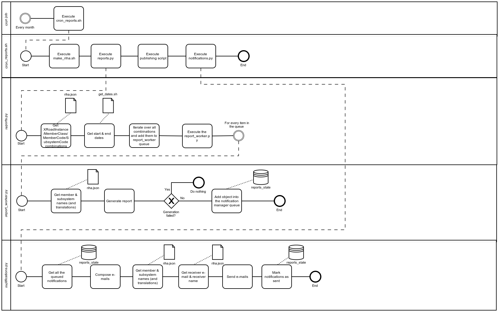
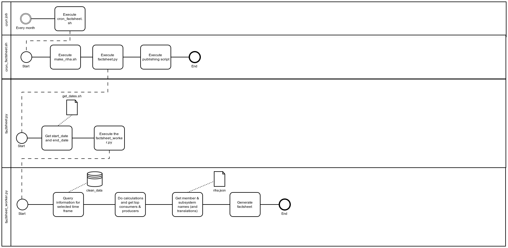

# X-Road v6 monitor project - Reports Module

## About

The reports module is part of [X-Road v6 monitor project](../readme.md), which includes modules of [Database module](database_module.md), [Collector module](collector_module.md), [Corrector module](corrector_module.md), [Analysis module](analysis_module.md), Reports module (this document) and [Opendata module](opendata_module.md).

Overall system, its users and rights, processes and directories are designed in a way, that all modules can reside in one server (different users but in same group) and also in separate servers. 

Overall system is also designed in a way, that allows to monitor data from different X-Road v6 instances (`ee-dev`, `ee-test`, `EE`), see also [X-Road v6 environments](https://www.ria.ee/en/x-road-environments.html#v6).

Overall system is also designed in a way, that can be used by X-Road Centre for all X-Road members as well as for Member own monitoring (includes possibilities to monitor also members data exchange partners).

The **reports module** is responsible for creating different reports about X-Road v6 members subsystems (datasets usage).
The execution of the reports module can be either performed automatically (via cron job) or manually.
Reports module includes generation of two types of reports: monthly reports (about every memberCode / subsystemCode usage statistics) and Factsheet creation process.

It is important to note that it can take up to 7 days for the security servers to provide the documents.
This means that if monthly reports are to be generated, the cron job should run **after** the 7th day of the month.

The module source code can be found at (ACL-protected):

```
https://stash.ria.ee/projects/XTEE6/repos/monitor/browse
```

and can be downloaded into server (ACL-protected):

```bash
export TMPDIR="/tmp" ; mkdir --parents ${TMPDIR}; cd ${TMPDIR}
# NB! git clone required only once
git clone https://stash.ria.ee/scm/xtee6/monitor.git
# when want just to refresh existing repository, use pull
cd ${TMPDIR}/monitor; git pull https://stash.ria.ee/scm/xtee6/monitor.git
```

## Diagram



## Networking

### Outgoing

- The reports module needs access to the Database Module (see [Database_Module](database_module.md)).
- The reports module needs access to the X-Road Central Server (http, port 80).
- The reports module needs access to the reports public publishing server (via rsync / scp, port 22).
- The reports module needs access to the SMTP to announce member/subsystem contacts about reports created and published (port 25).

### Incoming

No **incoming** connection is needed in the reports module.

## Installation

This sections describes the necessary steps to install the **reports module** in a Linux Ubuntu 16.04. 
To a complete overview of different modules and machines, please refer to the [System Architecture](system_architecture.md) documentation.

### Install required packages

To install the necessary packages, execute the following commands in the terminal:

```bash
sudo apt-get update
sudo apt-get install python3-pip
sudo pip3 install pymongo==3.4.0
sudo apt-get install libfreetype6-dev
sudo pip3 install matplotlib==2.0.2
sudo pip3 install pandas==0.20.3
sudo pip3 install Jinja2==2.9.6
sudo apt-get install python3-dev python-lxml python-cffi libcairo2 libpango1.0-0 libgdk-pixbuf2.0-0 libffi-dev shared-mime-info
sudo pip3 install WeasyPrint==0.39
sudo apt-get install libtiff5-dev libjpeg8-dev zlib1g-dev libfreetype6-dev liblcms2-dev libwebp-dev tcl8.6-dev tk8.6-dev python3-tk
sudo pip3 install Pillow==4.2.1
sudo pip3 install tinycss==0.4
sudo pip3 install requests==2.14.2
```

### Install reports module

The reports module uses the system user **reports** and group **opmon**.
Also, the user has to have ability to push generated reports into publishing server via rsync / scp. To allow this, ssh keys have to be exchanged.
To create group, user and exchange ssh keys, execute:

```bash
# Add group
sudo groupadd --force opmon
# Add user with home directory created
# sudo useradd --base-dir /opt --create-home --system --shell /bin/false --gid opmon reports
# Generate keys
sudo --user reports ssh-keygen -t rsa
# Set administrative user and publishing server values before usage
# export admin_user="" ; export publishing_server=""
# Appending public key to a remote file via SSH
sudo --user reports cat /opt/reports/.ssh/id_rsa.pub | ssh ${username}@${publishing_server} "cat >> /opt/reports/.ssh/authorized_keys"
```

The module files should be installed in the APPDIR directory, within a sub-folder named after the desired X-Road instance. 
In this manual, `/srv/app` is used as APPDIR and the `ee-dev` is used as INSTANCE (please change `ee-dev` to map your desired instance, example: `ee-test`, `EE`).

```bash
export APPDIR="/srv/app"
export INSTANCE="ee-dev"
# make necessary directories
sudo mkdir --parents ${APPDIR}/${INSTANCE}
sudo mkdir --parents ${APPDIR}/${INSTANCE}/logs
sudo mkdir --parents ${APPDIR}/${INSTANCE}/heartbeat
sudo mkdir --parents ${APPDIR}/${INSTANCE}/reports
sudo mkdir --parents ${APPDIR}/${INSTANCE}/factsheets
# correct necessary permissions
sudo chown root:opmon ${APPDIR}/${INSTANCE}/logs
sudo chmod g+w ${APPDIR}/${INSTANCE}/logs
sudo chown root:opmon ${APPDIR}/${INSTANCE}/heartbeat
sudo chmod g+w ${APPDIR}/${INSTANCE}/heartbeat
# Directories reports/ and factsheets/ are only for user reports
sudo chown reports:reports ${APPDIR}/${INSTANCE}/reports
sudo chown reports:reports ${APPDIR}/${INSTANCE}/factsheets
```

Copy the **reports module** code to the install folder and fix the file permissions:

```bash
# export TMPDIR="/tmp"; export APPDIR="/srv/app"; export INSTANCE="ee-dev"
sudo rsync --recursive --update --times ${TMPDIR}/monitor/reports_module ${APPDIR}/${INSTANCE}
# or 
# sudo cp --recursive --update ${TMPDIR}/monitor/reports_module ${APPDIR}/${INSTANCE}
```

# Monthly Reports about memberCode / subsystemCode usage

## Configuration

Settings for different X-Road instances have been prepared and can be used:

```bash
# export APPDIR="/srv/app"; export INSTANCE="ee-dev"
sudo rm ${APPDIR}/${INSTANCE}/reports_module/settings.py
sudo ln --symbolic ${APPDIR}/${INSTANCE}/reports_module/settings_${INSTANCE}.py ${APPDIR}/${INSTANCE}/reports_module/settings.py
```

If needed, edit necessary modifications to the settings file using your favorite text editor (here, **vi** is used):

```bash
# export APPDIR="/srv/app"; export INSTANCE="ee-dev"
sudo vi ${APPDIR}/${INSTANCE}/reports_module/settings.py
```

These are the settings that **must** be definitely set:

```python
MONGODB_USER = ""
MONGODB_PWD  = ""
MONGODB_SERVER = ""
MONGODB_SUFFIX = ""

# --------------------------------------------------------
# Configure notifications
# --------------------------------------------------------
# e-mail from where the reports will be sent
SENDER_EMAIL = "reports@ria.ee"
# the smtp host used for sending reports
# SMTP_HOST = 'smtp.aso.ee'
SMTP_HOST = '10.0.9.14'
# the smtp port used for sending reports
SMTP_PORT = 25
```

These are the settings that will work with default values set but can be changed while needed:

```python
# Reports output directory
REPORTS_PATH = "/srv/app/{0}/reports/".format(MONGODB_SUFFIX)
```

Available languages for the reports are:

```
en - english
et - estonian
```

The relevant translation files are in the folder `reports_module/lang`.

## The external files and additional scripts required for reports module

External files required for reports generation in reports_module are `RIHA_membercode-membername.txt`, `RIHA_subsystemcode-subsystemname.txt` and `RIHA_subsystemcode-contacts.txt`.
RIA system management personell is asked monthly to re-generate and update periodically (monthly) mentioned files. 
The format is described within the examples below.

### RIHA_membercode-membername.txt

TAB-delimited file with match between memberCode and memberName.

Sample:

```
memberCode	memberName
10000000	Company Test AS
```

### RIHA_subsystemcode-subsystemname.txt

TAB-delimited file with match between subSystemCode and subSystemName with translations of 'et' and 'en'.

Sample:

```
memberCode	v6 subSystemCode	subSystemName(et)	subSystemName(en)
10000000	10000000-name	Ettevõtte Test X-tee v6 alamsüsteem	Company Test X-Road v6 subsystem
```

### RIHA_subsystemcode-contacts.txt

TAB-delimited file with match between memberCode and subsystemCode and notification contact.

Sample:

```
memberCode	subSystemCode	subSystemContactFirstName	subSystemContactLastName	subSystemContactEMail
10000000	10000000-name	Firstname	Lastname	firstname.lastname@domain.com
```

### make_riha.sh

Bash script to retrieve subSystem list from X-Road Central Server and complement it with memberName, subsystemName and notification contacts (`subsystems_json.py` and `xrdinfo.py`).

Script requires X-Road Central Server IP / Name CENTRALSERVER as first parameter and must be configured during installation procedure.

```bash
# export APPDIR="/srv/app"; export INSTANCE="ee-dev"
sudo vi ${APPDIR}/${INSTANCE}/reports_module/make_riha.sh
```

**Note** Make sure to create different value of CENTRALSERVER for script `make_riha.sh`.
This setting can be changed in the settings file and the parameter name is `CENTRAL_SERVER`.

Script result from standard output is saved into file `riha.json`.

Sample:

```json
[
  {
    "subsystem_code": "10000000-name",
    "x_road_instance": "XTEE-CI-XM",
    "member_class": "GOV",
    "subsystem_name": {
      "en": "Company Test X-Road v6 subsystem",
      "et": "Ettevõtte Test X-tee v6 alamsüsteem"
    },
    "member_code": "10000000",
    "email": [
      {
        "name": "Firstname Lastname",
        "email": "firstname.lastname@domain.com"
      }
    ],
    "member_name": "Company Test AS"
  }
]
```

### get_dates.sh

```bash
# This file needs to output the following:
start_date(YYYY-MM-DD) end_date(YYYY-MM-DD)
# For example:
2017-05-01 2017-05-31
```

**NB!** Make sure to create different files for reports module and the Factsheet.
Because currently they are using the same file. 
And also make sure to change the **REPORT_DATES_PATH** and **FACTSHEET_DATES_PATH** in the settings file(s) accordingly.

Correct necessary permissions

```bash
# export APPDIR="/srv/app"; export INSTANCE="ee-dev"
sudo chown --recursive reports:opmon ${APPDIR}/${INSTANCE}/reports_module
sudo chmod --recursive -x+X ${APPDIR}/${INSTANCE}/reports_module
sudo chmod +x ${APPDIR}/${INSTANCE}/reports_module/*.sh
```


## Manual usage

Run the `report_worker.py` with `member_code`, `subsystem_code` (optional), `member_class`, `x_road_instance`, `start_date`, `end_date` and `language parameters`.
Here's an example of the script call WITH the subsystem_code:

```bash
# export APPDIR="/srv/app"; export INSTANCE="ee-dev"
cd ${APPDIR}/${INSTANCE}
sudo --user reports /usr/bin/python3 -m ./reports_module.report_worker 70006317 monitoring GOV ee-dev 2017-1-1 2018-1-1 et
```

Here's an example of the script call WITHOUT the `subystem_code` (generates report about when query logs did NOT include subsystem_code):

```bash
# export APPDIR="/srv/app"; export INSTANCE="ee-dev"
cd ${APPDIR}/${INSTANCE}
sudo --user reports /usr/bin/python3 -m ./reports_module.report_worker 70006317 GOV ee-dev 2017-1-1 2018-1-1 et
```

## CRON usage

Add **reports module** as a **cron job** to the **reports** user.

```bash
sudo crontab -e -u reports
```

The **cron job** entry (executes every day at 11:00, note that a different value might be needed in production)

```
0 11 * * * export APPDIR="/srv/app"; export INSTANCE="ee-dev"; cd ${APPDIR}/${INSTANCE}/reports_module; ./cron_reports.sh
```

To check if the reports module is properly installed in the reports user, execute:

```bash
sudo crontab -l -u reports
```

## Result

Check the availability of generated report(s) at the reports folder:

```bash
# export APPDIR="/srv/app"; export INSTANCE="ee-dev"
ls -l --recursive ${APPDIR}/${INSTANCE}/reports
```

The Report naming convention is the following:
```
"memberCode_startDate_endDate_creationDate_creationTime.pdf"
# For example: subsystemCodeA_2017-01-01_2017-12-31_2018-02-01_13-52-17-453770.pdf
```
The "startDate", "endDate" & the "creationDate" have the following format:
```
YYYY-MM-DD
# For example: 2017-12-31
```
The creationTime has the following format:
```
HH-MM-SS-MMMSSS
hour-minute-second-millisecond
# For example: 13-52-17-453770
```

# Open reports / Factsheet

* Factsheet is generated based on the previous calendar month's usage statistics. The Factsheet is generated and extraced into a text file, which is in a JSON format.
* The Factsheet uses some of the reports module's logic/functionality (code), then it it is located inside the reports module folder as well. 
* The Factsheet shares Logger with memberCode / subSystemCode monthly reports, ie. the logging is done into the same file as for the reports (reports_module.settings -> LOGGER_PATH).
* The Factsheet naming convention is the following: `start_date_end_date_creation_time.txt` (Ex: `2017-6-1_2017-6-30_2017-8-4_15-14-56-311873.txt`)

## Diagram



## Configuration

```bash
# export APPDIR="/srv/app"; export INSTANCE="ee-dev"
sudo vi ${APPDIR}/${INSTANCE}/reports_module/settings.py
```

The following settings are relevant for Factsheet generation:

```python
# This username is used for keeping a pointer in the database to make sure duplicated reports are not generated.
factsheet_username = "factsheet_{0}".format(MDB_SUFFIX)
# The number of top producers to have in the output file.
number_of_top_producers = 5
# The number of top consumers to have in the output file.
number_of_top_consumers = 5
# These member_code's will be excluded from the top_producers and top_consumers.
excluded_client_member_code = ["70005938", "70000591"]
# The path where the Factsheets will be generated.
factsheet_path = "/srv/app/{0}/factsheets/".format(MDB_SUFFIX)
# The path where the dates will be taken for the Factsheet.
FACTSHEET_DATES_PATH = "reports_module/get_dates.sh"
```

## Manual usage

Run the factsheet_worker.py with start_date(`YYYY-MM-DD`) and end_date(`YYYY-MM-DD`) parameters:

```bash
# export APPDIR="/srv/app"; export INSTANCE="ee-dev"
cd ${APPDIR}/${INSTANCE}
sudo -u reports /usr/bin/python3 -m reports_module.factsheet_worker "2017-01-01" "2018-01-01"
```

Check the Factsheet at the factsheets folder:

```bash
# export APPDIR="/srv/app"; export INSTANCE="ee-dev"
ls -l --recursive ${APPDIR}/${INSTANCE}/factsheets
```

## CRON usage

Set cron to run Factsheet every day at 11 am:

```bash
crontab -e
```

```
0 11 * * * export APPDIR="/srv/app"; export INSTANCE="ee-dev"; cd ${APPDIR}/${INSTANCE}/reports_module; ./cron_factsheet.sh
```

The FactSheet naming convention is the following:
```
"startDate_endDate_creationDate_creationTime.txt"
# For example: 2017-08-01_2017-08-31_2017-9-19_13-52-17-453770.txt
```
The "startDate", "endDate" & the "creationDate" have the following format:
```
YYYY-MM-DD
# For example: 2017-12-31
```
The creationTime has the following format:
```
HH-MM-SS-MMMSSS
hour-minute-second-millisecond
# For example: 13-52-17-453770
```

## Monitoring and Status

### Logging 

The **reports module** produces log files that, by default, are stored at `${APPDIR}/${INSTANCE}/logs`

To change the logging level, it is necessary to change the logger.setLevel parameter in the settings file:

```python
# INFO - logs INFO & WARNING & ERROR
# WARNING - logs WARNING & ERROR
# ERROR - logs ERROR
logger.setLevel(logging.INFO)
```

The time format for durations in the log files is the following: "HH:MM:SS".
For example:

```
"Finished process. Processing time: 00:02:56"
```

### Heartbeat

The Factsheet & Report module both have a heartbeat.json file.
The settings (in the settings file) for the heartbeat files are the following:

```python
# --------------------------------------------------------
# Configure heartbeats
# --------------------------------------------------------
FACTSHEET_HEARTBEAT_NAME = 'heartbeat_factsheet_{0}'.format(MONGODB_SUFFIX)
REPORT_HEARTBEAT_NAME = 'heartbeat_report_{0}'.format(MONGODB_SUFFIX)
HEARTBEAT_LOGGER_PATH = '/srv/app/{0}/heartbeat/'.format(MONGODB_SUFFIX)
```
So, for each MONGODB_SUFFIX (X-Road instance) a separate heartbeat will be generated.

The Reports module has a heartbeat.json file, by default, is stored at `${APPDIR}/${INSTANCE}/heartbeat`.

The heartbeat files consist of the following fields:

```
timestamp - the timestamp when the heartbeat was updated
module - module name
msg - message
version - version
```

The statuses used in the Reports and Factsheet generation in the heartbeat are the following:

```
"start"
"in_progress"
"success"
"error"
```

---


