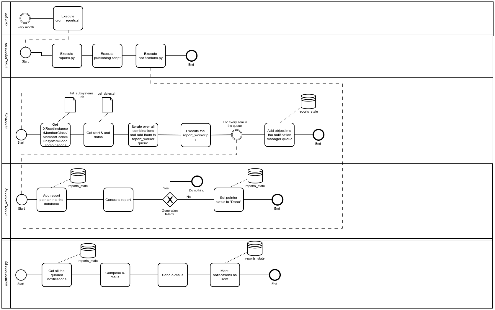

# X-Road v6 monitor project - Reports Module

## About

The reports module is part of [X-Road v6 monitor project](../readme.md), which includes modules of [Database module](database_module.md), [Collector module](collector_module.md), [Corrector module](corrector_module.md), [Analysis module](analysis_module.md), [Reports module (this document)](reports_module.md) and [Opendata module](opendata_module.md).

Overall system, its users and rights, processes and directories are designed in a way, that all modules can reside in one server and also in separate servers. 

Overall system is also designed in a way, that allows to monitor data from different X-Road v6 instances (ee-dev, ee-test, EE), see also [X-Road v6 environments](https://www.ria.ee/en/x-road-environments.html#v6).

Overall system is also designed in a way, that can be used by X-Road Centre for all X-Road members as well as for Member own monitoring (includes possibilities to monitor also members data exchange partners).

The **reports module** is responsible for creating different reports about X-Road v6 members subsystems (datasets usage).
The execution of the reports module can be either performed automatically (via cron job) or manually.
Reports module includes generation of two types of reports: monthly reports (about every memberCode / subsystemCode usage statistics) and Factsheet creation process.

The module source code can be found at (ACL-protected):

```
https://stash.ria.ee/projects/XTEE6/repos/monitor/browse
```

and can be downloaded into server (ACL-protected):

```bash
# NB! git clone required only once
cd ~; git clone https://stash.ria.ee/scm/xtee6/monitor.git
mkdir -p ~/monitor; cd ~/monitor; git pull https://stash.ria.ee/scm/xtee6/monitor.git
```

## Diagram



## Networking

### Outgoing

- The reports module needs access to the Database Module (see [Database_Module](database_module.md)).
- The reports module needs access to the reports public publishing server (via rsync / scp, port 22).
- The reports module needs access to the SMTP to announce member/subsystem contacts about reports created and published (port 25).

### Incoming

No **incoming** connection is needed in the reports module.

## Installation

This sections describes the necessary steps to install the **reports module** in a Linux Ubuntu 16.04. 
To a complete overview of different modules and machines, please refer to the [System Architecture](system_architecture.md) documentation.

### Install required packages

To install the necessary packages, execute the following commands in the terminal:

```
sudo apt-get update
sudo apt-get install python3-pip
sudo pip3 install pymongo==3.4.0
sudo apt-get install libfreetype6-dev
sudo pip3 install matplotlib==2.0.2
sudo pip3 install pandas==0.20.3
sudo pip3 install Jinja2==2.9.6
sudo apt-get install python3-dev python-lxml python-cffi libcairo2 libpango1.0-0 libgdk-pixbuf2.0-0 libffi-dev shared-mime-info
sudo pip3 install WeasyPrint==0.39
sudo apt-get install libtiff5-dev libjpeg8-dev zlib1g-dev libfreetype6-dev liblcms2-dev libwebp-dev tcl8.6-dev tk8.6-dev python3-tk
sudo pip3 install Pillow==4.2.1
sudo pip3 install tinycss==0.4
```

xmlstarlet also needs to be installed on the operating system:

```
sudo apt-get install xmlstarlet
```

### Install reports module

The reports module uses the system user **reports** and group **opmon**. To create them, execute:

```bash
sudo groupadd -f opmon
sudo useradd -M -r -s /bin/false -g opmon reports
```

The module files should be installed in the **/app/srv** directory, within a sub-folder named after the desired X-Road instance. 
In this manual, the "ee-dev" is used (please change "ee-dev" to map your desired instance, example: "ee-test", "EE").

```bash
# make necessary directories
sudo mkdir -p /srv/app/ee-dev
sudo mkdir -p /srv/app/ee-dev/logs
sudo mkdir -p /srv/app/ee-dev/heartbeat
sudo mkdir -p /srv/app/ee-dev/reports
sudo mkdir -p /srv/app/ee-dev/factsheets
# correct necessary permissions
sudo chown root:opmon /srv/app/ee-dev/logs
sudo chmod g+w /srv/app/ee-dev/logs
sudo chown root:opmon /srv/app/ee-dev/heartbeat
sudo chmod g+w /srv/app/ee-dev/heartbeat
sudo chown root:opmon /srv/app/ee-dev/reports
sudo chmod g+w /srv/app/ee-dev/reports
sudo chown root:opmon /srv/app/ee-dev/factsheets
sudo chmod g+w /srv/app/ee-dev/factsheets
```

Copy the **reports module** code to the install folder and fix the file permissions:

```bash
sudo rsync -r -t -u ~/monitor/reports_module /srv/app/ee-dev
# or
# sudo cp -u -r ~/monitor/reports_module /srv/app/ee-dev
sudo chown -R reports:opmon /srv/app/ee-dev/reports_module
sudo chmod -R -x+X /srv/app/ee-dev/reports_module
sudo chmod +x /srv/app/ee-dev/reports_module/*.sh
```

# Monthly Reports about memberCode / subsystemCode usage

## Configuration

Settings for different X-Road instances have been prepared and can be used:

```bash
sudo rm /srv/app/ee-dev/reports_module/settings.py
sudo ln -s /srv/app/ee-dev/reports_module/settings_ee-dev.py /srv/app/ee-dev/reports_module/settings.py
```

If needed, edit necessary modifications to the settings file using your favorite text editor (here, **vi** is used):

```bash
sudo vi /srv/app/ee-dev/reports_module/settings.py
```

These are the settings that **must** be definitely set:

```
MONGODB_USER 
MONGODB_PWD 
MONGODB_SERVER 
MONGODB_SUFFIX 

# --------------------------------------------------------
# Configure notifications
# --------------------------------------------------------
# e-mail from where the reports will be sent
SENDER_EMAIL = "reports@ria.ee"
# the smtp host used for sending reports
# SMTP_HOST = 'smtp.aso.ee'
SMTP_HOST = '10.0.9.14'
# the smtp port used for sending reports
SMTP_PORT = 25
```

These are the settings that will work with default values set but can be changed while needed:
```
# Reports output directory
REPORTS_PATH = "/srv/app/{0}/reports/".format(MONGODB_SUFFIX)
```

Available languages for the reports are:

```
en - english
et - estonian
```

The relevant translation files are in the folder `reports_module/lang`.

## The external files required for reports module

These are the files that were created and must be updated.
RIA system management personell is asked monthly to review and update mentioned files. 
The format is described within the examples below.

### contacts_dict.txt

TODO Sample:

```
# "x_road_instance/member_class/member_code/subsystem_code": ["receiver_email", "receiver_name"],

[
[{"ee-dev/COM/10011039/ehma": ["reports@ria.ee", "Dev Usage"]}],
[{"ee-dev/COM/10011039/hampi": ["reports@ria.ee", "Dev Usage"]}],
[{"ee-dev/COM/10015238/alexelaenergia": ["reports@ria.ee", "Dev Usage"]}],
[{"ee-dev/COM/10017059/hampi": ["reports@ria.ee", "Dev Usage"]}],
[{"ee-dev/COM/10030278/csap": ["reports@ria.ee", "Dev Usage"]}]
]
```

### member_name_dict.txt

TODO Sample:

```
# "x_road_instance/member_class/member_code": ["estonian_name"],

{
"ee-dev/GOV/70006317": ["Riigi Infosüsteemi Amet"],
"ee-dev/COM/10140133": ["Cybernetica AS"],
"ee-dev/COM/11045744": ["ASA QUALITY SERVICES OÜ"],
"ee-dev/COM/11333578": ["Aktors OÜ"],
"ee-dev/COM/10006966": ["AS CGI Eesti"]
}

```

### subsystem_name_dict.txt

TODO Sample:

```
# "x_road_instance/member_class/member_code/subsystem_code": ["estonian_name", "english_name"],

{
"ee-dev/COM/10011039/ehma": ["Olympic Casino Eesti AS EHMA X-tee alamsüsteem", ""],
"ee-dev/COM/10011039/hampi": ["Olympic Casino Eesti AS HAMPI X-tee alamsüsteem", ""],
"ee-dev/COM/10015238/alexelaenergia": ["10015238-alexelaenergia", ""],
"ee-dev/COM/10017059/hampi": ["Aktsiaselts Pafer HAMPI X-tee alamsüsteem", ""],
"ee-dev/COM/10030278/csap": ["CarlsbergSAP", "CarlsbergSAP"]
}
```

### get_dates.sh

```
# This file needs to output the following:
start_date(YYYY-MM-DD) end_date(YYYY-MM-DD)
# For example:
2017-05-01 2017-05-31
```

**NB!** Make sure to create different files for reports module and the Factsheet.
Because currently they are using the same file. 
And also make sure to change the **REPORT_DATES_PATH** and **FACTSHEET_DATES_PATH** in the settings file(s) accordingly.


### list_subsystems.sh

TODO Sample:

```
# This file needs to output the following:
x_road_instance/member_class/member_code/subsystemcode
# NB: One combination per line
```

It is possible to print out the whole list of memberCode & subsystemCode combinations for given X-Road instance.
In order to do so subsystem_list_generator script can be used.

```bash
cd /srv/app/ee-dev/
sudo -u reports /usr/bin/python3 -m reports_module.subsystem_list_generator
```

**Note:** Company-specific X-Road v6 Security Server IP/Name has to be set up, setting SERVER.

## Manual usage

Run the report_worker.py with member_code, subsystem_code (optional), member_class, x_road_instance, start_date, end_date and language parameters.
Here's an example of the script call WITH the subsystem_code:

```bash
cd /srv/app/ee-dev/reports_module/
sudo -u reports /usr/bin/python3 -m ./reports_module.report_worker 70006317 monitoring GOV ee-dev 2017-1-1 2018-1-1 et
```

Here's an example of the script call WITHOUT the subystem_code (generates report about when query logs did NOT include subsystem_code):

```bash
cd /srv/app/ee-dev/reports_module/
sudo -u reports /usr/bin/python3 -m ./reports_module.report_worker 70006317 GOV ee-dev 2017-1-1 2018-1-1 et
```

## CRON usage

Add **reports module** as a **cron job** to the **reports** user.

```bash
sudo crontab -e -u reports
```

The **cron job** entry (executes every day at 11:00, note that a different value might be needed in production)

```
0 11 * * * cd /srv/app/ee-dev; ./reports_module/cron_reports.sh
```

To check if the reports module is properly installed in the reports user, execute:

```bash
sudo crontab -l -u reports
```

## Result

Check the Report at the reports folder:

```bash
cd /srv/app/ee-dev/reports
```

The Report naming convention is the following: TODO

TODO: Check the Reports availablility after synchronization into site with public but limited availability

TODO: Check the email notification availablility after synchronization into site with public but limited availability

# Open reports / Factsheet

* Factsheet is generated based on the previous calendar month's usage statistics. The Factsheet is generated and extraced into a text file, which is in a JSON format.
* The Factsheet uses some of the reports module's logic/functionality (code), then it it is located inside the reports module folder as well. 
* The Factsheet shares Logger with memberCode / subSystemCode monthly reports, ie. the logging is done into the same file as for the reports (reports_module.settings -> LOGGER_PATH).
* The Factsheet naming convention is the following: "start_date_end_date_creation_time.txt" (Ex: 2017-6-1_2017-6-30_2017-8-4_15-14-56-311873.txt)

## Configuration

```bash
sudo vi /srv/app/ee-dev/reports_module/settings.py
```

The following settings are relevant for Factsheet generation:

```
# This username is used for keeping a pointer in the database to make sure duplicated reports are not generated.
factsheet_username = "factsheet_{0}".format(MDB_SUFFIX)
# The number of top producers to have in the output file.
number_of_top_producers = 5
# The number of top consumers to have in the output file.
number_of_top_consumers = 5
# These member_code's will be excluded from the top_producers and top_consumers.
excluded_client_member_code = ["70005938", "70000591"]
# The path where the Factsheets will be generated.
factsheet_path = "/srv/app/{0}/factsheets/".format(MDB_SUFFIX)
# The path where the dates will be taken for the Factsheet.
FACTSHEET_DATES_PATH = "reports_module/get_dates.sh"
```

## Manual usage

Run the factsheet_worker.py with start_date("YYYY-MM-DD") and end_date("YYYY-MM-DD") parameters:

```bash
cd /srv/app/ee-dev/
sudo -u reports /usr/bin/python3 -m reports_module.factsheet_worker "2017-01-01" "2018-01-01"
```

Check the Factsheet at the factsheets folder:

```bash
cd /srv/app/ee-dev/factsheets/
```

## CRON usage

Set cron to run Factsheet every day at 11 am:

```
crontab -e

0 11 * * * cd /srv/app/ee-dev/ ; ./reports_module/cron_factsheet.sh
```

## Monitoring and Status

### Logging 

The **reports module** produces log files that, by default, are stored at:

```
/srv/app/ee-dev/logs
```

To change the logging level, it is necessary to change the logger.setLevel parameter in the settings file:

```
# INFO - logs INFO & WARNING & ERROR
# WARNING - logs WARNING & ERROR
# ERROR - logs ERROR
logger.setLevel(logging.INFO)
```

### Heartbeat

The Factsheet & Report module both have a heartbeat.json file.
The settings (in the settings file) for the heartbeat files are the following:

```
# --------------------------------------------------------
# Configure heartbeats
# --------------------------------------------------------
FACTSHEET_HEARTBEAT_NAME = 'heartbeat_factsheet_{0}'.format(MONGODB_SUFFIX)
REPORT_HEARTBEAT_NAME = 'heartbeat_report_{0}'.format(MONGODB_SUFFIX)
HEARTBEAT_LOGGER_PATH = '/srv/app/{0}/heartbeat/'.format(MONGODB_SUFFIX)
```
So, for each MONGODB_SUFFIX (X-Road instance) a separate heartbeat will be generated.

The Reports module has a heartbeat.json file, by default, is stored at:

```
/srv/app/ee-dev/heartbeat
```

The heartbeat files consist of the following fields:

```
timestamp - the timestamp when the heartbeat was updated
module - module name
msg - message
version - version
```

The statuses used in the Reports generation in the heartbeat are the following:

```
"start"
"in_progress"
"success"
"error"
```

The statuses used for FactSheet generation in the heartbeat are the following:

```
"start"
"in_progress"
"success"
"error"
```


---


